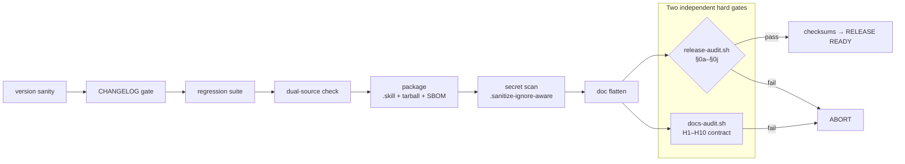

<!-- visual asset committed: docs/assets/release-demo.jpeg (Boss-supplied, human-maintained — not pipeline-generated). See frozen spec §4 H10. -->
<!-- Deep-Audit N/0/1 count is NOT gitx-managed — §0f consistency + §0i exactness + per-repo test. -->
<div align="center">

# 🚀 GitX

**Treat releasing as engineering discipline — a cross-project release pipeline, not a chore.**

Most release bugs are not code bugs: a forgotten version bump, a doc that lies, a
secret that slips into a public mirror, a tarball nobody can reproduce. GitX collapses
the entire release ritual into one fail-closed pipeline where every policy is a shell
assertion that *aborts the build* — not a wiki line nobody reads. It ships any
`skills/<name>/SKILL.md` project, installs across four CLIs, and holds itself to the
same standard it imposes on others: GitX releases GitX.

[English](README.md) · [中文](README_CN.md)

<!-- gitx:managed:badges -->
[](LICENSE)
[](tests/run_all.sh)
[](scripts/release-audit.sh)
[](#quick-start)
[](SKILL.md)
[](https://github.com/tkxlab-ai/GitX/releases)
[](#development-journey)
<!-- /gitx:managed:badges -->

</div>

<!-- gitx:managed:build-metrics -->
> 🛠 **Live build metrics** — Version **v1.12.0** · Released **2026-05-18** · Engineered with **Claude (Opus/Sonnet) · Codex · Gemini** across hundreds of sessions · Cumulative AI tokens since the first prototype (v0.9.4, 2026-04-22), estimated: **≈ 300M+ input/output + ≈ 3B+ cached** · Span: **~60 releases across 26 days** (2026-04-22 → 2026-05-18)
<!-- /gitx:managed:build-metrics -->

**[Documentation](#table-of-contents) · [Changelog](Release/CHANGELOG.md) · [Report a bug](https://github.com/tkxlab-ai/GitX/issues) · [Security](SECURITY.md)**

---

## What's New

<!-- gitx:managed:whats-new -->
**v1.12.0 — 2026-05-18**

- Post-`v1.11.0` adversarial-review hardening — six successive `codex` findings closed at the class: a reusable template scaffolded a missing hero image; `docs-audit` `H10` lost origin enforcement; enforcement was contingent on a README reference; an optional `grep` under `set -euo pipefail` aborted the whole audit; the `hero_asset` declaration was wrongly mirrored into the bundled skill; a referenced missing asset was silently skipped.
- `tests/test_docs_pipeline.sh` — the last `set -e`-unsafe `rc` capture converted to the project-standard safe idiom.
- Hero showcase is origin-only — the hardcoded `` was removed from the reusable README templates; the host-specific image now lives solely in the origin's live README, enforced by a manifest-driven `hero_asset:` gate, and `H10` is strict again.
- README badges restyled to the `shields.io` `for-the-badge` family with brand logos; the `@machine` Tests token and the Deep-Audit citation stay byte-frozen so no gate invariant shifts.
- Hero asset replaced with a Boss-supplied web-optimized build (`docs/assets/release-demo.jpeg`) — smaller, content-equivalent.
<!-- /gitx:managed:whats-new -->

Full history (59 releases) → [`Release/CHANGELOG.md`](Release/CHANGELOG.md).

---

## Table of Contents

- [What's New](#whats-new)
- [CLI in Action](#cli-in-action)
- [Why GitX](#why-gitx)
- [Comparison](#comparison)
- [Command Surface](#command-surface)
- [Pipeline & Audit Gates](#pipeline--audit-gates)
- [Quick Start](#quick-start)
- [Configuration](#configuration)
- [Architecture](#architecture)
- [Symbol & State System](#symbol--state-system)
- [Testing](#testing)
- [Development Journey](#development-journey)
- [Audits & Code Review](#audits--code-review)
- [Multi-Model AI Collaboration](#multi-model-ai-collaboration)
- [Research & References](#research--references)
- [Security](#security)
- [FAQ](#faq)
- [Compatibility](#compatibility)
- [Roadmap](#roadmap)
- [Acknowledgments](#acknowledgments)
- [Contributing](#contributing)
- [Special Thanks](#special-thanks)
- [License](#license)

---

## CLI in Action

<!-- visual asset: human-supplied, place file at docs/assets/release-demo.* — NOT pipeline-generated, NOT @machine; docs-audit asserts the reference + file presence only, never the image content -->
<p align="center">
  
</p>

<details><summary>Text transcript (accessible fallback)</summary>

```console
$ /gitx-release --version v1.2.0
▸ version sanity ............ v1.2.0 (VERSION ×2 + 3 manifests aligned)
▸ CHANGELOG gate ............ v1.2.0 entry present, non-placeholder ✅
▸ regression suite .......... 102 suites / 0 failed 🎉
▸ dual-source check ......... scripts/ ≡ bundled mirror (byte-identical)
▸ package ................... git_release_skill-v1.2.0.skill + tarball + SBOM
▸ secret scan ............... .sanitize-ignore-aware → clean ✅
▸ doc flatten ............... commands/ + references/ → Release/
▸ Deep Audit ................ ✅ 245 / ❌ 0 / ➖ 1   (§8 latest = expected SKIP; TOTAL == live total)
▸ checksums ................. sha256 × 6 written
RELEASE READY · nothing pushed (push is user-manual by policy)
```

</details>

---

## Why GitX

**The problem.** Releasing is a ritual: bump the version everywhere, run the tests, scan for secrets, flatten docs into the bundle, prove integrity, audit the result, mirror to a public host without leaking the private one. Every step is skippable, and every skipped step is a future incident — a stale README, a leaked token, an unreproducible tarball, a tag with no release.

**The approach — policy as code.** GitX's contract (`references/TKX_Git_Release_policy_and_process.md`) is not advisory prose; each clause is a runtime shell assertion. A violated policy does not warn — it **aborts the build**. The audit is 245 executable checks with a three-state result where `TOTAL = PASS + FAIL + SKIP` must hold exactly.

**What makes it different:**

- **Zero hardcode, genuinely cross-project** — `PROJECT_NAME`/`SKILL_NAME` are environment-derived; GitX has self-baked sibling skills, not just itself.
- **Supply-chain hardened** — reproducible tarball, `checksums.txt` verified by `install.sh`, SBOM, private-state closed to a five-facet symmetric-parity standard.
- **Fail-closed by construction** — missing tool → SKIP, never silent pass; generic guards never FAIL a dependent skill for tooling it lacks.
- **A 0-issue meta-skill** — before any public release: full suite green, Deep Audit `N/0`, dual-engine adversarial closure converged. Never shipped on a proxy metric.

<sub>[↑ back to top](#table-of-contents)</sub>

---

## Comparison

How GitX differs from general-purpose release tooling — it targets the *skill/agent* packaging world, fail-closed, with no CI runtime required:

Symbols use the same three-state system as the rest of GitX — ✅ has it · ❌ explicitly not · ➖ not applicable ([Symbol & State System](#symbol--state-system)):

| Capability | GitX | semantic-release | release-please | goreleaser |
|---|:---:|:---:|:---:|:---:|
| Target | `skills/<name>/SKILL.md`, 4 CLIs | npm-centric | language-agnostic | Go binaries |
| Policy = fail-closed shell assertions | ✅ | ❌ | ❌ | ❌ |
| Runs locally, **no CI runtime** | ✅ | ❌ | ❌ | ❌ |
| Secret-leak gate (five-facet, TDD-locked) | ✅ | ➖ | ➖ | ➖ |
| Doc-rot gate (`§0f/§0g` + `docs-audit`) | ✅ | ➖ | ➖ <sub>CHANGELOG only</sub> | ➖ |
| Self-published **and** self-audited | ✅ | ➖ | ➖ | ➖ |
| No automated push (upstream user-manual) | ✅ | ❌ | ❌ | ❌ |

GitX is not a replacement for CI release bots; it is the *local discipline layer* a skill must pass before anything reaches a remote.

<sub>[↑ back to top](#table-of-contents)</sub>

---

## Command Surface

<!-- gitx:managed:command-surface -->
Two install paths.

**A. install.sh** — run `bash install.sh` (skill + flat commands; no plugin needed)

- `/gitx-release` — the skill itself
- `/gitx-init`
- `/gitx-sop`

**B. Plugin marketplace** — `/plugin marketplace add tkxlab-ai/marketplace` then `/plugin install gitx@tkx-skills` (`/gitx` colon namespace)

- `/gitx:audit`
- `/gitx:init`
- `/gitx:release`
- `/gitx:scan`
- `/gitx:sop`

> The `/gitx` colon-prefixed commands are plugin-only (a plugin-namespacing design, per official docs). install.sh gives flat `/gitx-release` + `/<cmd>`; the colon form requires this plugin install and is NEVER synthesized from flat commands.
<!-- /gitx:managed:command-surface -->

### Direct script entrypoints (advanced)

Slash commands are thin shims over these — call them directly for CI, debugging, or fine-grained steps. Interfaces are exactly as the scripts declare:

| Script | Interface | Purpose |
|---|---|---|
| `scripts/gitx-release.sh` | `[--dry-run] [--version vX.Y.Z]` | entry wrapper — sets up the diagnostic log, then runs `release.sh` |
| `scripts/release.sh` | `PROJECT_ROOT=<dir> … <version> [--dry-run]` | the pipeline itself (the stages above) |
| `scripts/release-audit.sh` | `<version>` | post-release Deep Audit only — `§0a–§0j`, three-state (`--inline` is an internal, provenance-gated flag `release.sh` passes; not for direct use) |
| `scripts/release-sanitize.sh` | `[--label <name>] <dir>` | scan a staged directory for PII / secrets / fingerprints |
| `scripts/scan-credentials.sh` | `[file]` _or_ `cat file \| …` | detect plaintext credentials in one file or piped stdin |
| `scripts/gitx-readme.sh` | `[--check\|--init\|--force\|--dry-run]` (default: refresh) | deterministic README ghostwriter (the docs pipeline) |
| `scripts/sync-dual-source.sh` | `[--dry-run]` | sync `scripts/` → `skills/<skill>/scripts/` (master → mirror) |
| `scripts/emit-token-usage.sh` | — | analyze a skill bundle's runtime context-token cost |

### Examples

```bash
# Release a skill project (most common) — auto-increments the patch version
cd your-skill-project
/gitx-release
/gitx-release --version v1.2.0          # or an explicit version

# Dry-run the full pipeline — no files written, see every gate
PROJECT_ROOT="$(pwd)" bash ~/.agents/skills/gitx-release/scripts/gitx-release.sh --dry-run

# Audit an already-built release without rebuilding
bash ~/.agents/skills/gitx-release/scripts/release-audit.sh v1.2.0

# Teach a brand-new project how to release, then render its GitHub SOP
/gitx-init
/gitx-sop

# Pre-flight a directory for secrets before you ever package
bash ~/.agents/skills/gitx-release/scripts/release-sanitize.sh ./dist
```

<sub>[↑ back to top](#table-of-contents)</sub>

---

## Pipeline & Audit Gates

The release pipeline is a sequence of fail-closed stages; the audit is a set of static gates `§0a`–`§0j`. Representative gates:

| Gate | Enforces |
|---|---|
| `§0b` | INSTALL.md + install.sh unified-standard compliance |
| `§0c/§0d` | gitx-init / gitx-sop template integrity (generate-only, no git/gh) |
| `§0f` | doc numeric-rot — README numbers vs ground truth |
| `§0g` | readme-sync — generated docs vs committed (drift → fail) |
| `§0i` | deep-audit-exactness — non-counting meta-gate, citations == live total |
| `§0j` | shellcheck — the *exact* command GitHub CI runs, inside the pipeline |

No automated `git push`/`tag` (upstream ops are user-manual); writes confined to `Release/` + `CHANGELOG`; the private host never reaches the public mirror (five-facet exclusion, TDD-locked). Reading the code shows *what*; the policy doc records *why*.

<sub>[↑ back to top](#table-of-contents)</sub>

---

## Quick Start

**1 · Prerequisites** — Bash 3.2+ (POSIX; macOS system bash works), git 2.x, optional `python3 + venv` (skill-creator validation auto-bootstraps a vendored copy + venv).

**2 · Install — two ways**

*Option A — Plugin marketplace (recommended for Claude Code plugin users):*
```text
/plugin marketplace add tkxlab-ai/marketplace
/plugin install gitx@tkx-skills
```

*Option B — install.sh (one command, all four CLIs, no plugin system):*
```bash
git clone https://github.com/tkxlab-ai/GitX.git && cd GitX
bash install.sh                 # → ~/.agents/skills/gitx-release (canonical)
                                 #   + Claude Code & OpenCode symlinks
                                 #   Codex & Gemini auto-discover
bash install.sh --dry-run       # preview every action, touch nothing
bash install.sh --force         # reinstall over an existing install — overwrites
                                 #   installed command files WITHOUT backup (data-loss;
                                 #   use deliberately, prefer --dry-run first)
```

**3 · Release any skill project**
```bash
cd your-skill-project
/gitx-release                   # default: auto-increment patch, full pipeline
/gitx-release --version v1.2.0  # explicit version
bash ~/.agents/skills/gitx-release/scripts/release-audit.sh v1.2.0   # audit only
```

**4 · Teach a project to release** — `/gitx-init` scaffolds the contract; `/gitx-sop` renders the GitHub-publish runbook. Both generate only — a human-supervised AI executes.

<sub>[↑ back to top](#table-of-contents)</sub>

---

## Configuration

Zero config required — everything is environment-derived. Override only when a project's layout differs from the convention.

<details>
<summary><b>Environment variables</b> (click to expand)</summary>

| Variable | Default | Purpose |
|---|---|---|
| `PROJECT_ROOT` | `$(pwd)` | project being released (must hold `VERSION` + `SKILL.md`) |
| `PROJECT_NAME` | derived from dir | artifact / tarball name prefix |
| `SKILL_NAME` | single `skills/<name>/` | which skill bundle to flatten |
| `SKILL_EXCLUDE_PATTERNS` | `*-workspace\|*-evals` | dirs excluded from skill-name detection |
| `GH_TOKEN` | — | only for the no-`gh` publish fallback (prefer `gh auth login`) |

</details>

<details>
<summary><b>Files that shape a release</b> (click to expand)</summary>

| File | Role |
|---|---|
| `VERSION` | single source of version truth (mirrored in the skill bundle) |
| `Release/CHANGELOG.md` / `_CN.md` | EN history (release gate reads the top entry) + CN parallel (structural parity, H5) |
| `.sanitize-ignore` | whitelist for the secret scanner (intentional fixtures) |
| `references/docs-contract/manifest.txt` | the declarative document contract `docs-audit` enforces |

</details>

<sub>[↑ back to top](#table-of-contents)</sub>

---

## Architecture



Two independent hard gates, neither bypassable. **`release-audit.sh §0j`** runs the *exact* shellcheck command GitHub CI runs — the pipeline can no longer be blind to a public red X. **`docs-audit.sh`** enforces the document contract: section set + order + bilingual structural parity + every machine slot equal to ground truth. Both run before any artifact exists.

**Project structure:**

```
GitX/
├── SKILL.md                  agent system prompt + trigger words
├── scripts/                  release.sh · release-audit.sh · release-sanitize.sh
│                             docs-pipeline.sh · docs-audit.sh   (master)
├── skills/gitx-release/      byte-identical bundled mirror (CI-enforced)
├── references/
│   ├── TKX_Git_Release_policy_and_process.md   behavioral contract
│   ├── readme/               dual-tree doc templates (EN + CN)
│   └── docs-contract/        the declarative document contract
├── tests/                    pure-bash suites + hostile fixtures
├── Release/CHANGELOG.md      EN history (source of truth)
└── Release/CHANGELOG_CN.md   CN parallel (structural parity)
```

**Dual-source / dual-tree discipline.** `scripts/` is master; `skills/gitx-release/scripts/` is a byte-identical bundled mirror; `references/readme/` mirrors into the skill tree. CI **and** an in-pipeline check fail the release on any drift — the bundle a user installs is provably the tree that was tested.

**Built with:** pure Bash 3.2+ (POSIX) · awk (BSD-compatible) · shellcheck · CycloneDX SBOM — zero external runtime dependencies.

<sub>[↑ back to top](#table-of-contents)</sub>

---

## Symbol & State System

Every gate reports one of five states; the meaning is fixed project-wide so output is scannable and the audit total is exact:

| Symbol | Meaning | Counts toward |
|---|---|---|
| ✅ | pass | PASS |
| ❌ | fail — fatal, aborts the release | FAIL |
| ➖ | skip — not applicable / tooling absent (generic-safe) | SKIP |
| ⚠️ | soft warning — visible, non-blocking | — (non-counting) |
| ⛔ | user-unlockable gate (deliberate friction) | — |

`TOTAL = PASS + FAIL + SKIP` is itself audited (`§0i` exactness, a *non-counting* meta-gate) so adding a gate can never silently rot the headline number.

<sub>[↑ back to top](#table-of-contents)</sub>

---

## Testing

Pure-bash harness, zero external test dependencies. `bash tests/run_all.sh` runs everything; the pipeline re-runs it as a release gate.

<!-- gitx:managed:suite-count -->
106
<!-- /gitx:managed:suite-count -->

**Real-Machine Test Results** — full suite green · smoke 6/6 · Deep Audit strict PASS · `shasum -c` OK. The exact suite count above is machine-derived from the live test tree and re-verified every release (it never goes stale by hand).

**Suite coverage:**

| Area | What it locks |
|---|---|
| Audit gates | three-state counting, `§0f/§0g/§0h/§0i/§0j` behavior, exactness meta-gate, SKIP discipline |
| Secret / sanitize | true-positive & true-negative regex, `.sanitize-ignore` whitelist, fixtures stay exempt |
| Dual-source / dual-tree | `scripts/` ≡ bundled mirror, `references/readme/` parity, byte-identical |
| CHANGELOG / version | awk range-extraction boundaries, version glob routing (incl. two-digit minors) |
| gitx-init / gitx-sop | template integrity, generate-only (no git/gh), credential-gate correctness |
| README / docs | numeric accuracy, managed-region rewrite idempotence, `--check` drift exit codes |
| Install / output | path resolution, dry-run touches nothing, output-style contract |
| Private-state | five-facet leak excludes, nested-path detection, benign-fixture non-trip |

**Methodology.** TDD iron law — RED (failing test first) → GREEN (minimal code) → full regression; no production code without a failing test. The audit *is* executable policy: each clause has a test proving it fires. Fixtures are deliberately hostile (planted secrets, malformed manifests, two-digit minors) and whitelisted so guards cannot self-exempt. Release-affecting changes additionally pass dual-engine adversarial closure, iterated to clean.

<sub>[↑ back to top](#table-of-contents)</sub>

---

## Development Journey

GitX did not begin as a release tool — it began as a refusal to ship on faith.

**2026-04-22 — prototype.** The first build (`v0.9.4`) already shipped four CRITICAL Sprint-1 TDD fixes. `v0.9.5` was **yanked, never shipped** — the failure became a permanent Gotcha and a guard. The tone was set: every scar becomes policy.

**2026-04-29 → early May — first stable & multi-project proof.** `v1.0.0` reached stable; the `v1.1.x` line proved the pipeline on *more than itself* via self-bake (shipping a sibling skill), added supply-chain verification, became Syncthing-aware after real cross-machine incidents. `v1.5.0` unified the install standard across four CLIs; `v1.6.0` added `gitx-init`.

**2026-05-15 — the discipline sprint.** Nine `v1.7.x` patch releases in a single day — a focused campaign that systematically closed a credential-gate class in the publish SOP and built five-facet defense-in-depth around private state. `v1.8.x` raised public-page completeness; `v1.9.8` root-caused README numeric rot and added `§0f`.

**2026-05-16 — meta-skill rigor.** `v1.10.0` shipped the projen ghostwriter + `§0g/§0h/§0i`; `v1.10.1` converged a five-round dual-engine closure + five-facet private-state hardening; `v1.11.0` extracts docs into an independent bilingual pipeline with a hard fail-closed contract and pulls CI's shellcheck gate into the pipeline; `v1.12.0` (this release) converges a six-round `codex` adversarial review on the docs contract — origin-only hero, strict `H10`, manifest-driven enforcement.

**Numbers at a glance:**

| Metric | Value |
|---|---|
| Prototype → today | 2026-04-22 → 2026-05-18 (26 days) |
| Releases | ~60 (v0.9.4 → v1.12.0) |
| Commits | 90 |
| Test suites | full green — see [Testing](#testing) |
| Audit checks | 240 (three-state, exactness-gated) |
| Hardest day | 9 patch releases (2026-05-15 SOP sprint) |

**Status:** stable & production-ready since `v1.0.0` (2026-04-29); current GA `v1.12.0`. Self-baked through its own pipeline every release.

**Key decisions:** deterministic doc generation (projen, no LLM in loop) · fail-closed default with generic-safe SKIP · non-counting meta-gates (`§0i`, `§0j`) · five-facet symmetric parity for private state · bilingual via parallel locale files with structural-parity guards.

<sub>[↑ back to top](#table-of-contents)</sub>

---

## Audits & Code Review

GitX treats review as a gate, not a courtesy. Authoring and review are separated; every release-affecting change runs **dual-engine adversarial closure** — an independent reviewer subagent plus Codex, each reconciling findings against ground truth, iterated until both converge. Internal green is necessary but never sufficient: the definition of done is *external* — CI green and the rendered page matching the contract. The five-round closure that shipped `v1.10.1` is the standard, not the exception.

<sub>[↑ back to top](#table-of-contents)</sub>

---

## Multi-Model AI Collaboration

GitX is built by orchestrating models against each other, not trusting any one:

| Model | Role |
|---|---|
| Claude (Opus / Sonnet) | primary authoring, TDD execution, pipeline reasoning |
| OpenAI Codex | adversarial review — challenges design, assumptions, leaks |
| Google Gemini | independent second-engine review / cross-check |

Findings are reconciled against ground truth (code + git + CHANGELOG), never accepted on authority. This is why the build-metrics block counts tokens across models and sessions — the collaboration *is* the engineering method.

<sub>[↑ back to top](#table-of-contents)</sub>

---

## Research & References

- **Generator design** follows the projen / terraform-docs / markdown-magic lineage: deterministic managed-region generation + a check gate; the LLM never sits in the deterministic loop (first-draft assist only).
- **Behavioral contract** — `references/TKX_Git_Release_policy_and_process.md` (the source of truth the scripts enforce).
- **Supply chain** — reproducible builds, SBOM (CycloneDX), checksum-verified install.

<sub>[↑ back to top](#table-of-contents)</sub>

---

## Security

GitX is a release tool — its threat model is *leaking what should stay private* and *shipping what wasn't verified*.

- **Private host never reaches a public mirror** — five-facet symmetric exclusion (`.gitignore` + `.sanitize-ignore` + rsync `--exclude` + audit fail-closed regex + rebrand allow-list), each TDD-locked; detection *and* prevention, dual-source.
- **No automated upstream writes** — `git push`/`tag`/GitHub Release are user-manual by policy; the pipeline cannot push on its own.
- **Secret scan is fail-closed** — honors `.sanitize-ignore` (cannot false-FAIL its own fixtures) yet aborts on any real token; runs again on the composed publish snapshot.
- **Supply chain** — reproducible source tarball, CycloneDX SBOM, `checksums.txt` verified by `install.sh` before it trusts the bundle.

Report a vulnerability privately via [`SECURITY.md`](SECURITY.md). Do not open a public issue for security reports.

<sub>[↑ back to top](#table-of-contents)</sub>

---

## FAQ

<details><summary><b>Does GitX push to GitHub or tag for me?</b></summary>

No — by policy. Upstream-affecting operations are user-manual. GitX produces and verifies the release artifact; a human-supervised step publishes it via the rendered SOP runbook.
</details>

<details><summary><b>Do I need CI to use it?</b></summary>

No. GitX runs locally, pre-push, with no CI runtime. It *also* mirrors the exact shellcheck gate CI runs (`§0j`) so a green pipeline means a green CI.
</details>

<details><summary><b>What does "0-issue meta-skill" actually mean?</b></summary>

Before any public release: full suite green, Deep Audit `N/0`, and dual-engine adversarial closure converged. Internal green is necessary but never sufficient — external acceptance (CI green + rendered page matching the contract) is the definition of done.
</details>

<details><summary><b>It refused to release / aborted. Why?</b></summary>

A fail-closed gate fired — by design. Read the last `❌` line: stale CHANGELOG entry, dual-source drift, a real secret, doc numeric rot, or a shellcheck finding. Fix the cause; the gate is the feature, not the obstacle.
</details>

<details><summary><b>Why bilingual, and why parallel files instead of inline translation?</b></summary>

Determinism. Inline locale markers are fragile and generate-time translation is non-reproducible (LLM in the loop). Parallel locale files with a structural-parity guard keep each document readable and machine-verifiable.
</details>

<sub>[↑ back to top](#table-of-contents)</sub>

---

## Compatibility

| Surface | Support |
|---|---|
| Shell | Bash 3.2+ (macOS system bash), POSIX |
| OS | macOS · Linux |
| CLIs | Claude Code · Codex · OpenCode · Gemini (one install covers all) |
| Optional | `python3 + venv` — skill-creator validation, auto-bootstrapped |

<sub>[↑ back to top](#table-of-contents)</sub>

---

## Roadmap

**Planned:**

- [ ] Bilingual contract extended from README + CHANGELOG to INSTALL / SKILL / per-command docs
- [ ] Sibling-org onboarding (1by1X / ClaudeMeX / HandoffX) onto the gitx documentation standard
- [ ] Central marketplace as the single install surface for the TKX skill family

**Recently shipped:**

- [x] Independent bilingual documentation pipeline + hard `docs-audit` contract — `v1.11.0`
- [x] In-pipeline shellcheck gate matching GitHub CI (`§0j`) — `v1.11.0`

Full shipped history → [`Release/CHANGELOG.md`](Release/CHANGELOG.md).

<sub>[↑ back to top](#table-of-contents)</sub>

---

## Acknowledgments

To the discipline of policy-as-code, the projen lineage that proved deterministic doc generation, and the multi-model review loop that keeps a self-publishing meta-skill honest.

**Contact** — TKXLAB.AI · [github.com/tkxlab-ai](https://github.com/tkxlab-ai) · project: [github.com/tkxlab-ai/GitX](https://github.com/tkxlab-ai/GitX)

---

## Contributing

PRs welcome. The pipeline is the gate, not a formality:

1. Fork and branch (`feat/<topic>`).
2. Write the failing test first (TDD iron law — no production code without a failing test).
3. Implement minimally; keep `scripts/` and the bundled mirror byte-identical (`bash scripts/sync-dual-source.sh`).
4. Green the gate: `bash tests/run_all.sh` **and** `bash scripts/release-audit.sh <ver>` Deep Audit `N/0` **and** `docs-audit.sh` exit 0.
5. Open a PR; CI (shellcheck · test-suite · audit-dry) must be green.

See [`CONTRIBUTING.md`](CONTRIBUTING.md) for the full workflow, [`CODE_OF_CONDUCT.md`](CODE_OF_CONDUCT.md) for community expectations, and [`SECURITY.md`](SECURITY.md) to report vulnerabilities privately.

---

## Special Thanks

Built in deep collaboration with **Claude (Opus / Sonnet)**, **OpenAI Codex**, and **Google Gemini** — used not as autocomplete but as independent adversarial reviewers. Every release-affecting change passed dual-engine closure before it shipped. GitX is, itself, an artifact of multi-model engineering discipline.

<sub>[↑ back to top](#table-of-contents)</sub>

---

## License

MIT © TKXLAB.AI — see [`LICENSE`](LICENSE). Free for personal and commercial use; a link back to the GitHub org is appreciated.
