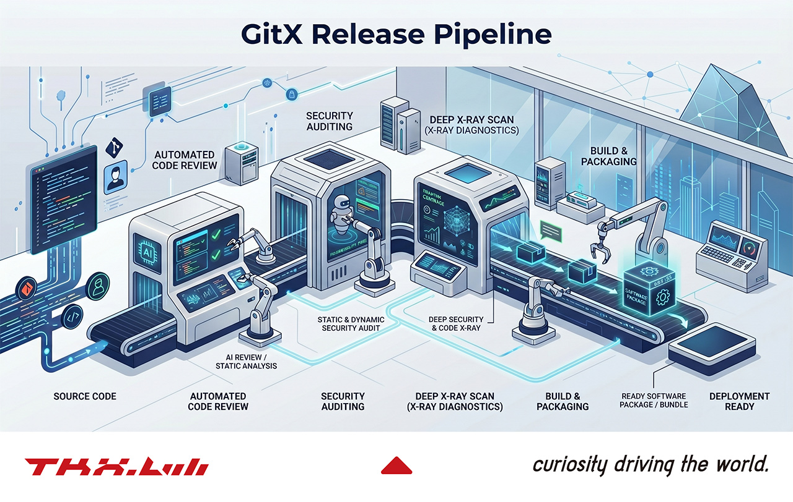
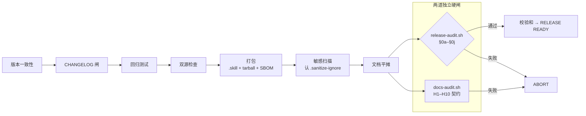

<!-- 视觉资产已提交：docs/assets/release-demo.jpeg（Boss 供图，人工维护，非流水线生成）。见 frozen spec §4 H10。 -->
<!-- Deep-Audit N/0/1 计数非 gitx 托管 — §0f 一致性 + §0i 精确性 + 单仓测试。 -->
<div align="center">

# 🚀 GitX

**把"发版"当工程纪律来做的跨项目发布流水线，而不是一件杂活。**

大多数发版事故并非代码缺陷：漏改一处版本号、文档说谎、密钥溜进公开镜像、
谁也复现不出的 tarball。GitX 把整套发版仪式收敛成一条 fail-closed 流水线——
每条政策都是一个会**中止构建**的 shell 断言，而不是没人看的 wiki 条目。它能
发布任何 `skills/<name>/SKILL.md` 项目，一次安装覆盖四个 CLI，并用它强加给
别人的标准要求自己：GitX 用 GitX 发布 GitX。

[English](README.md) · [中文](README_CN.md)

<!-- gitx:managed:badges -->
[](LICENSE)
[](tests/run_all.sh)
[](scripts/release-audit.sh)
[](#快速开始)
[](SKILL.md)
[](https://github.com/tkxlab-ai/GitX/releases)
[](#开发历程)
<!-- /gitx:managed:badges -->

</div>

<!-- gitx:managed:build-metrics -->
> 🛠 **实时构建指标** — 版本 **v1.12.0** · 发版日期 **2026-05-18** · 由 **Claude（Opus/Sonnet）· Codex · Gemini** 跨数百会话打造 · 自首个原型（v0.9.4，2026-04-22）起累计 AI token 估算：**≈ 3 亿+ 输入/输出 + ≈ 30 亿+ 缓存** · 跨度：**26 天 ~60 个发布**（2026-04-22 → 2026-05-18）
<!-- /gitx:managed:build-metrics -->

**[文档](#目录) · [更新日志](Release/CHANGELOG_CN.md) · [报告缺陷](https://github.com/tkxlab-ai/GitX/issues) · [安全](SECURITY.md)**

---

## 更新摘要

<!-- gitx:managed:whats-new -->
**v1.12.0 — 2026-05-18**

- Post-`v1.11.0` adversarial-review hardening — six successive `codex` findings closed at the class: a reusable template scaffolded a missing hero image; `docs-audit` `H10` lost origin enforcement; enforcement was contingent on a README reference; an optional `grep` under `set -euo pipefail` aborted the whole audit; the `hero_asset` declaration was wrongly mirrored into the bundled skill; a referenced missing asset was silently skipped.
- `tests/test_docs_pipeline.sh` — the last `set -e`-unsafe `rc` capture converted to the project-standard safe idiom.
- Hero showcase is origin-only — the hardcoded `` was removed from the reusable README templates; the host-specific image now lives solely in the origin's live README, enforced by a manifest-driven `hero_asset:` gate, and `H10` is strict again.
- README badges restyled to the `shields.io` `for-the-badge` family with brand logos; the `@machine` Tests token and the Deep-Audit citation stay byte-frozen so no gate invariant shifts.
- Hero asset replaced with a Boss-supplied web-optimized build (`docs/assets/release-demo.jpeg`) — smaller, content-equivalent.
<!-- /gitx:managed:whats-new -->

完整历史（59 个发布）→ [`Release/CHANGELOG_CN.md`](Release/CHANGELOG_CN.md)。

---

## 目录

- [更新摘要](#更新摘要)
- [命令行实况](#命令行实况)
- [为什么选择 GitX](#为什么选择-gitx)
- [横向对比](#横向对比)
- [命令面](#命令面)
- [流水线与审计闸](#流水线与审计闸)
- [快速开始](#快速开始)
- [配置](#配置)
- [架构](#架构)
- [符号与状态系统](#符号与状态系统)
- [测试](#测试)
- [开发历程](#开发历程)
- [审查与代码评审](#审查与代码评审)
- [多模型 AI 协作](#多模型-ai-协作)
- [研究与参考](#研究与参考)
- [安全](#安全)
- [常见问题](#常见问题)
- [兼容性](#兼容性)
- [路线图](#路线图)
- [鸣谢](#鸣谢)
- [贡献](#贡献)
- [特别致谢](#特别致谢)
- [许可](#许可)

---

## 命令行实况

<!-- 视觉资产：人工提供，文件置于 docs/assets/release-demo.* —— 非流水线生成、非 @machine；docs-audit 只校验引用 + 文件在场，绝不校验图像内容 -->
<p align="center">
  
</p>

<details><summary>文本转录（无障碍回退）</summary>

```console
$ /gitx-release --version v1.2.0
▸ 版本一致性 ............ v1.2.0（VERSION ×2 + 3 个 manifest 对齐）
▸ CHANGELOG 闸 .......... v1.2.0 条目存在、非占位 ✅
▸ 回归测试 .............. 102 套件 / 0 失败 🎉
▸ 双源检查 .............. scripts/ ≡ 打包镜像（字节一致）
▸ 打包 .................. git_release_skill-v1.2.0.skill + tarball + SBOM
▸ 敏感扫描 .............. 认 .sanitize-ignore → 干净 ✅
▸ 文档平摊 .............. commands/ + references/ → Release/
▸ 深度审计 .............. ✅ 245 / ❌ 0 / ➖ 1（§8 latest = 预期 SKIP；TOTAL == 实时总数）
▸ 校验和 ................ sha256 × 6 写入
RELEASE READY · 未推送（按政策 push 由人工执行）
```

</details>

---

## 为什么选择 GitX

**问题。** 发版是一套仪式：到处改版本号、跑测试、扫密钥、把文档平摊进 bundle、证明完整性、审计结果、镜像到公开仓而不泄露私有仓。每一步都可跳过，每一处跳过都是未来的事故——陈旧的 README、泄露的 token、复现不出的 tarball、有 tag 没 release。

**做法——政策即代码。** GitX 的契约（`references/TKX_Git_Release_policy_and_process.md`）不是建议性散文，每一条款都是运行时 shell 断言。违反的政策不会警告——它**中止构建**。审计是 245 条可执行检查，三态结果，`TOTAL = PASS + FAIL + SKIP` 必须精确成立。

**与众不同之处：**

- **零硬编码、真正跨项目** —— `PROJECT_NAME`/`SKILL_NAME` 全部环境派生；GitX 自发版过兄弟 skill，不只发自己。
- **供应链加固** —— 可复现 tarball、`install.sh` 信任前校验 `checksums.txt`、产出 SBOM、私有态泄漏面收敛到五-facet 对称平价标准。
- **构造上 fail-closed** —— 缺工具→SKIP，绝不静默放过；通用守护绝不因依赖技能缺工具而 FAIL。
- **0-issue 元技能** —— 任何公开发版前：全量绿、深度审计 `N/0`、双引擎对抗闭环收敛。从不靠代理指标发版。

<sub>[↑ 回到顶部](#目录)</sub>

---

## 横向对比

GitX 与通用发版工具的差异——它面向**技能/智能体**打包世界，fail-closed，且不需要 CI 运行时：

符号沿用 GitX 同一套三态系统——✅ 具备 · ❌ 明确没有 · ➖ 不适用（[符号与状态系统](#符号与状态系统)）：

| 能力 | GitX | semantic-release | release-please | goreleaser |
|---|:---:|:---:|:---:|:---:|
| 目标 | `skills/<name>/SKILL.md`，4 CLI | 偏 npm | 语言无关 | Go 二进制 |
| 政策＝fail-closed shell 断言 | ✅ | ❌ | ❌ | ❌ |
| 本地运行、**无需 CI 运行时** | ✅ | ❌ | ❌ | ❌ |
| 密钥泄漏闸（五-facet、TDD 锁） | ✅ | ➖ | ➖ | ➖ |
| 文档漂移闸（`§0f/§0g` + `docs-audit`） | ✅ | ➖ | ➖ <sub>仅 CHANGELOG</sub> | ➖ |
| 自发布**且**自审计 | ✅ | ➖ | ➖ | ➖ |
| 不自动 push（上游由人工） | ✅ | ❌ | ❌ | ❌ |

GitX 不是 CI 发版机器人的替代品；它是任何技能在抵达远端之前必须先过的**本地纪律层**。

<sub>[↑ 回到顶部](#目录)</sub>

---

## 命令面

<!-- gitx:managed:command-surface -->
两种安装路径。

**A. install.sh** — 运行 `bash install.sh`（技能 + 扁平命令；无需插件）

- `/gitx-release` — the skill itself
- `/gitx-init`
- `/gitx-sop`

**B. 插件市场** — `/plugin marketplace add tkxlab-ai/marketplace` 然后 `/plugin install gitx@tkx-skills`（`/gitx` 冒号命名空间）

- `/gitx:audit`
- `/gitx:init`
- `/gitx:release`
- `/gitx:scan`
- `/gitx:sop`

> `/gitx` 冒号前缀命令仅限插件（官方文档的插件命名空间设计）。install.sh 提供扁平 `/gitx-release` + `/<cmd>`；冒号形式需要安装此插件，从不由扁平命令合成。
<!-- /gitx:managed:command-surface -->

### 直接脚本入口（进阶）

斜杠命令是这些脚本的薄壳——CI、调试或细粒度步骤可直接调用。接口与脚本声明完全一致：

| 脚本 | 接口 | 用途 |
|---|---|---|
| `scripts/gitx-release.sh` | `[--dry-run] [--version vX.Y.Z]` | 入口 wrapper —— 建诊断日志，再跑 `release.sh` |
| `scripts/release.sh` | `PROJECT_ROOT=<dir> … <version> [--dry-run]` | 流水线本体（上述阶段） |
| `scripts/release-audit.sh` | `<version>` | 仅深度审计 —— `§0a–§0j`，三态（`--inline` 是 `release.sh` 专用、provenance 门控的内部 flag，不供直接使用） |
| `scripts/release-sanitize.sh` | `[--label <name>] <dir>` | 扫描已暂存目录的 PII / 密钥 / 指纹 |
| `scripts/scan-credentials.sh` | `[file]` _或_ `cat file \| …` | 检测单文件或管道 stdin 的明文凭证 |
| `scripts/gitx-readme.sh` | `[--check\|--init\|--force\|--dry-run]`（默认 refresh） | 确定性 README 代笔器（文档流水线） |
| `scripts/sync-dual-source.sh` | `[--dry-run]` | 同步 `scripts/` → `skills/<skill>/scripts/`（主→镜像） |
| `scripts/emit-token-usage.sh` | — | 分析技能 bundle 的运行时上下文 token 成本 |

### 示例

```bash
# 发布一个 skill 项目（最常用）—— 默认自动递增 patch 版本
cd your-skill-project
/gitx-release
/gitx-release --version v1.2.0          # 或指定显式版本

# 全流水线 dry-run —— 不写文件，看每一道闸
PROJECT_ROOT="$(pwd)" bash ~/.agents/skills/gitx-release/scripts/gitx-release.sh --dry-run

# 只审计一个已构建的发布物，不重建
bash ~/.agents/skills/gitx-release/scripts/release-audit.sh v1.2.0

# 教会一个全新项目发版，再渲染它的 GitHub SOP
/gitx-init
/gitx-sop

# 打包前先体检一个目录有没有密钥
bash ~/.agents/skills/gitx-release/scripts/release-sanitize.sh ./dist
```

<sub>[↑ 回到顶部](#目录)</sub>

---

## 流水线与审计闸

发版流水线是一串 fail-closed 阶段；审计是一组静态闸 `§0a`–`§0j`。代表性闸：

| 闸 | 强制 |
|---|---|
| `§0b` | INSTALL.md + install.sh 统一标准合规 |
| `§0c/§0d` | gitx-init / gitx-sop 模板完整性（只生成，不碰 git/gh） |
| `§0f` | 文档数值漂移 —— README 数字 vs ground truth |
| `§0g` | readme-sync —— 生成文档 vs 已提交（漂移即失败） |
| `§0i` | deep-audit-exactness —— 非计数 meta-gate，引用 == 实时总数 |
| `§0j` | shellcheck —— GitHub CI 跑的*同一条*命令，搬进流水线内 |

不自动 `git push`/`tag`（上游操作由人工）；写入限于 `Release/` + `CHANGELOG`；私有 host 绝不进公开镜像（五-facet 排除，TDD 锁）。读代码看到"做什么"；政策文档记"为什么"。

<sub>[↑ 回到顶部](#目录)</sub>

---

## 快速开始

**1 · 前置** — Bash 3.2+（POSIX；macOS 系统 bash 可用）、git 2.x、可选 `python3 + venv`（skill-creator 校验自举一份 vendored 副本 + venv）。

**2 · 安装 —— 两种方式**

*方式 A —— 插件市场（Claude Code 插件用户推荐）：*
```text
/plugin marketplace add tkxlab-ai/marketplace
/plugin install gitx@tkx-skills
```

*方式 B —— install.sh（一条命令，全四个 CLI，无需插件系统）：*
```bash
git clone https://github.com/tkxlab-ai/GitX.git && cd GitX
bash install.sh                 # → ~/.agents/skills/gitx-release（规范路径）
                                 #   + Claude Code 与 OpenCode 软链
                                 #   Codex 与 Gemini 自动发现
bash install.sh --dry-run       # 预览每个动作，不碰任何文件
bash install.sh --force         # 在已有安装上重装 —— 无备份覆盖已装命令文件
                                 #   （有数据丢失风险；请谨慎使用，建议先 --dry-run）
```

**3 · 发布任意 skill 项目**
```bash
cd your-skill-project
/gitx-release                   # 默认：自动递增 patch，完整流水线
/gitx-release --version v1.2.0  # 显式版本
bash ~/.agents/skills/gitx-release/scripts/release-audit.sh v1.2.0   # 仅审计
```

**4 · 教会一个项目发版** — `/gitx-init` 生成契约；`/gitx-sop` 渲染 GitHub 发布 runbook。两者只生成 —— 由人工监督的 AI 执行。

<sub>[↑ 回到顶部](#目录)</sub>

---

## 配置

零配置即可运行——一切环境派生。仅当项目布局与约定不同才需覆盖。

<details>
<summary><b>环境变量</b>（点击展开）</summary>

| 变量 | 默认 | 用途 |
|---|---|---|
| `PROJECT_ROOT` | `$(pwd)` | 待发版项目（须含 `VERSION` + `SKILL.md`） |
| `PROJECT_NAME` | 由目录派生 | 产物 / tarball 名前缀 |
| `SKILL_NAME` | 唯一 `skills/<name>/` | 平摊哪个 skill bundle |
| `SKILL_EXCLUDE_PATTERNS` | `*-workspace\|*-evals` | skill 名识别排除的目录 |
| `GH_TOKEN` | — | 仅用于无 `gh` 的发布兜底（优先 `gh auth login`） |

</details>

<details>
<summary><b>影响发版的文件</b>（点击展开）</summary>

| 文件 | 角色 |
|---|---|
| `VERSION` | 版本唯一真相源（在 skill bundle 内有镜像） |
| `Release/CHANGELOG.md` / `_CN.md` | 中英历史 —— 发版闸读顶部条目 |
| `.sanitize-ignore` | 敏感扫描器的白名单（有意的测试夹具） |
| `references/docs-contract/manifest.txt` | `docs-audit` 强制的声明式文档契约 |

</details>

<sub>[↑ 回到顶部](#目录)</sub>

---

## 架构



两道独立硬闸，皆不可绕过。**`release-audit.sh §0j`** 跑 GitHub CI 跑的*同一条* shellcheck 命令——流水线再也不会对公开红叉视而不见。**`docs-audit.sh`** 强制文档契约：段集 + 顺序 + 双语结构平价 + 每个机器槽位等于 ground truth。两者都在产出任何产物前运行。

**项目结构：**

```
GitX/
├── SKILL.md                  智能体系统提示 + 触发词
├── scripts/                  release.sh · release-audit.sh · release-sanitize.sh
│                             docs-pipeline.sh · docs-audit.sh   （主）
├── skills/gitx-release/      字节一致的打包镜像（CI 强制）
├── references/
│   ├── TKX_Git_Release_policy_and_process.md   行为契约
│   ├── readme/               双树文档模板（中 + 英）
│   └── docs-contract/        声明式文档契约
├── tests/                    纯 Bash 套件 + 敌意夹具
├── Release/CHANGELOG.md      英文历史（真相源）
└── Release/CHANGELOG_CN.md   中文平行（结构平价）
```

**构建栈：** 纯 Bash 3.2+（POSIX）· awk（BSD 兼容）· shellcheck · CycloneDX SBOM —— 零外部运行时依赖。

<sub>[↑ 回到顶部](#目录)</sub>

---

## 符号与状态系统

每道闸报告五态之一；含义全项目固定，使输出可扫读、审计总数精确：

| 符号 | 含义 | 计入 |
|---|---|---|
| ✅ | 通过 | PASS |
| ❌ | 失败 —— 致命，中止发版 | FAIL |
| ➖ | 跳过 —— 不适用 / 缺工具（通用安全） | SKIP |
| ⚠️ | 软警告 —— 可见、不阻断 | —（非计数） |
| ⛔ | 用户可解锁的门（有意的摩擦） | — |

`TOTAL = PASS + FAIL + SKIP` 本身受审计（`§0i` 精确性，一个*非计数* meta-gate），所以新增一道闸绝不会静默 rot 掉头条数字。

<sub>[↑ 回到顶部](#目录)</sub>

---

## 测试

纯 Bash 测试架，零外部测试依赖。`bash tests/run_all.sh` 跑全量；流水线将其作为发版闸再跑一次。

<!-- gitx:managed:suite-count -->
106
<!-- /gitx:managed:suite-count -->

**真机测试结果** —— 全套件绿 · 冒烟 6/6 · 深度审计严格 PASS · `shasum -c` OK。上方精确套件数由实时测试树机器派生、每次发版复核（绝不手工 stale）。

**套件覆盖：**

| 领域 | 锁住什么 |
|---|---|
| 审计闸 | 三态计数、`§0f/§0g/§0h/§0i/§0j` 行为、精确性 meta-gate、SKIP 纪律 |
| 敏感/脱敏 | 真阳真阴正则、`.sanitize-ignore` 白名单、夹具保持豁免 |
| 双源/双树 | `scripts/` ≡ 打包镜像、`references/readme/` 平价、字节一致 |
| CHANGELOG/版本 | awk 区间提取边界、版本 glob 路由（含两位次版本） |
| gitx-init/gitx-sop | 模板完整性、只生成（不碰 git/gh）、凭证门正确性 |
| README/文档 | 数值精确性、managed 区块重写幂等、`--check` 漂移退出码 |
| 安装/输出 | 路径解析、dry-run 不碰文件、输出风格契约 |
| 私有态 | 五-facet 泄漏排除、嵌套路径检测、良性夹具不误触 |

**方法论。** TDD 铁律 —— RED（先写失败测试）→ GREEN（最小实现）→ 全量回归；没有失败测试就没有生产代码。审计*即*可执行政策：每条款都有证明它会触发的测试。夹具刻意敌意（植入密钥、畸形 manifest、两位次版本）且白名单化，使守护无法自我豁免。影响发版的改动另过双引擎对抗闭环，迭代到干净。

<sub>[↑ 回到顶部](#目录)</sub>

---

## 开发历程

GitX 的起点不是一个发版工具——而是拒绝凭信心发版。

**2026-04-22 —— 原型。** 首个构建（`v0.9.4`）已带四个 CRITICAL Sprint-1 TDD 修复。`v0.9.5` 被**撤回、从未发出**——这次失败被永久编成一条 Gotcha 并变成守护。基调由此定下：每一道伤疤都变成政策。

**2026-04-29 → 五月初 —— 首个稳定 & 多项目验证。** `v1.0.0` 达稳定；`v1.1.x` 线通过自发版在*不止自己*上验证（发布一个兄弟 skill），加入供应链校验，经历真实跨机同步事故后变得 Syncthing 感知。`v1.5.0` 统一四 CLI 安装标准；`v1.6.0` 加 `gitx-init`。

**2026-05-15 —— 纪律冲刺。** 单日发出九个 `v1.7.x` 补丁——一场系统性关闭发布 SOP 凭证门类缺陷、并围绕私有态构建五-facet 纵深防御的集中战役。`v1.8.x` 抬高公开页完整性；`v1.9.8` 根治 README 数值漂移并加 `§0f`。

**2026-05-16 —— 元技能严苛。** `v1.10.0` 出 projen 代笔器 + `§0g/§0h/§0i`；`v1.10.1` 收敛五轮双引擎闭环 + 五-facet 私有态加固；`v1.11.0` 把文档抽成独立双语流水线、配硬 fail-closed 契约，并把 CI 的 shellcheck 闸搬进流水线本身；`v1.12.0`（本版）收敛六轮 `codex` 对抗审——hero 仅 origin、`H10` 严格、manifest 驱动强制。

**数字一览：**

| 指标 | 值 |
|---|---|
| 原型 → 今 | 2026-04-22 → 2026-05-18（26 天） |
| 发布 | ~60 个（v0.9.4 → v1.12.0） |
| 提交 | 90 |
| 测试套件 | 全绿 —— 见[测试](#测试) |
| 审计检查 | 240（三态、精确性门控） |
| 最硬一天 | 9 个补丁发布（2026-05-15 SOP 冲刺） |

**状态：** 自 `v1.0.0`（2026-04-29）起稳定、production-ready；当前 GA `v1.12.0`。每次发版均经自身流水线自发版。

**塑造它的关键决策：** 确定性文档生成（projen，LLM 不进回路）· fail-closed 默认 + 缺工具通用 SKIP · 非计数 meta-gate（`§0i`、`§0j`）· 私有态五-facet 对称平价 · 双语用平行 locale 文件 + 结构平价守护。

<sub>[↑ 回到顶部](#目录)</sub>

---

## 审查与代码评审

GitX 把评审当门，不当客套。作者与评审分离；每个影响发版的改动跑**双引擎对抗闭环**——一个独立评审 subagent 加 Codex，各自对 ground truth 复核findings，迭代到双方收敛。内部绿是必要但永不充分：完成的定义是*外部*的——CI 绿且渲染页符合契约。发出 `v1.10.1` 的那次五轮闭环是标准，不是例外。

<sub>[↑ 回到顶部](#目录)</sub>

---

## 多模型 AI 协作

GitX 靠让模型互相对抗构建，不信任任何单一模型：

| 模型 | 角色 |
|---|---|
| Claude（Opus / Sonnet） | 主创作、TDD 执行、流水线推理 |
| OpenAI Codex | 对抗评审 —— 挑战设计、假设、泄漏 |
| Google Gemini | 独立第二引擎评审 / 交叉核对 |

findings 对 ground truth（代码 + git + CHANGELOG）复核，绝不凭权威接受。这就是构建指标块按模型与会话累计 token 的原因——协作*本身*就是工程方法。

<sub>[↑ 回到顶部](#目录)</sub>

---

## 研究与参考

- **生成器设计**遵循 projen / terraform-docs / markdown-magic 谱系：确定性 managed 区块生成 + check 闸；LLM 绝不进确定性回路（仅首稿辅助）。
- **行为契约** —— `references/TKX_Git_Release_policy_and_process.md`（脚本强制的真相源）。
- **供应链** —— 可复现构建、SBOM（CycloneDX）、校验和验证的安装。

<sub>[↑ 回到顶部](#目录)</sub>

---

## 安全

GitX 是发版工具——它的威胁模型是*泄露应保密的*与*发出未经验证的*。

- **私有 host 绝不进公开镜像** —— 五-facet 对称排除（`.gitignore` + `.sanitize-ignore` + rsync `--exclude` + 审计 fail-closed 正则 + rebrand 白名单），各 TDD 锁；检测*与*预防，双源。
- **不自动写上游** —— `git push`/`tag`/GitHub Release 按政策由人工；流水线无法自行 push。
- **敏感扫描 fail-closed** —— 认 `.sanitize-ignore`（不会误伤自身夹具）但遇任何真 token 即中止；在组装好的发布快照上再扫一次。
- **供应链** —— 可复现源码 tarball、CycloneDX SBOM、`install.sh` 信任 bundle 前校验 `checksums.txt`。

私下报告漏洞见 [`SECURITY.md`](SECURITY.md)。安全报告请勿开公开 issue。

<sub>[↑ 回到顶部](#目录)</sub>

---

## 常见问题

<details><summary><b>GitX 会替我 push 到 GitHub 或打 tag 吗？</b></summary>

不会——按政策。影响上游的操作由人工。GitX 产出并验证发布物；人工监督的一步通过渲染出的 SOP runbook 发布。
</details>

<details><summary><b>用它需要 CI 吗？</b></summary>

不需要。GitX 本地、push 前运行，无 CI 运行时。它*还*镜像 CI 跑的同一条 shellcheck 闸（`§0j`），所以流水线绿就意味着 CI 绿。
</details>

<details><summary><b>"0-issue 元技能"到底什么意思？</b></summary>

任何公开发版前：全量绿、深度审计 `N/0`、双引擎对抗闭环收敛。内部绿是必要但永不充分——完成的定义是外部的（CI 绿 + 渲染页符合契约）。
</details>

<details><summary><b>它拒绝发版 / 中止了，为什么？</b></summary>

某道 fail-closed 闸触发了——这是设计。读最后那行 `❌`：陈旧 CHANGELOG 条目、双源漂移、真密钥、文档数值漂移、或 shellcheck findings。修因；闸是特性，不是障碍。
</details>

<details><summary><b>为什么双语，且用平行文件而非内联翻译？</b></summary>

确定性。内联 locale 标记脆弱，生成时翻译不可复现（LLM 进回路）。平行 locale 文件 + 结构平价守护让每篇可读且可机器校验。
</details>

<sub>[↑ 回到顶部](#目录)</sub>

---

## 兼容性

| 面 | 支持 |
|---|---|
| Shell | Bash 3.2+（macOS 系统 bash）、POSIX |
| 操作系统 | macOS · Linux |
| CLI | Claude Code · Codex · OpenCode · Gemini（一次安装全覆盖） |
| 可选 | `python3 + venv` —— skill-creator 校验，自举 |

<sub>[↑ 回到顶部](#目录)</sub>

---

## 路线图

**计划中：**

- [ ] 双语契约从 README + CHANGELOG 扩展到 INSTALL / SKILL / 各命令文档
- [ ] 兄弟仓上手（1by1X / ClaudeMeX / HandoffX）接入 gitx 文档标准
- [ ] 中心 marketplace 作为 TKX 技能族单一安装入口

**近期已交付：**

- [x] 独立双语文档流水线 + 硬 `docs-audit` 契约 —— `v1.11.0`
- [x] 与 GitHub CI 一致的流水线内 shellcheck 闸（`§0j`）—— `v1.11.0`

完整已发布历史 → [`Release/CHANGELOG_CN.md`](Release/CHANGELOG_CN.md)。

<sub>[↑ 回到顶部](#目录)</sub>

---

## 鸣谢

致政策即代码的纪律、证明确定性文档生成的 projen 谱系，以及让一个自发布元技能保持诚实的多模型评审回路。

**联系** — TKXLAB.AI · [github.com/tkxlab-ai](https://github.com/tkxlab-ai) · 项目：[github.com/tkxlab-ai/GitX](https://github.com/tkxlab-ai/GitX)

---

## 贡献

欢迎 PR。流水线即门，不是形式：

1. Fork 并开分支（`feat/<topic>`）。
2. 先写失败测试（TDD 铁律——没有失败测试就没有生产代码）。
3. 最小实现；保持 `scripts/` 与打包镜像字节一致（`bash scripts/sync-dual-source.sh`）。
4. 过闸：`bash tests/run_all.sh` **且** `bash scripts/release-audit.sh <ver>` 深度审计 `N/0` **且** `docs-audit.sh` exit 0。
5. 开 PR；CI（shellcheck · test-suite · audit-dry）必须绿。

完整工作流见 [`CONTRIBUTING.md`](CONTRIBUTING.md)；社区行为准则见 [`CODE_OF_CONDUCT.md`](CODE_OF_CONDUCT.md)；私下报告漏洞见 [`SECURITY.md`](SECURITY.md)。

---

## 特别致谢

与 **Claude（Opus / Sonnet）**、**OpenAI Codex**、**Google Gemini** 深度协作构建——它们不是自动补全，而是独立的对抗式评审者。每一个影响发版的改动都先过双引擎闭环才发出。GitX 本身就是多模型工程纪律的产物。

<sub>[↑ 回到顶部](#目录)</sub>

---

## 许可

MIT © TKXLAB.AI —— 见 [`LICENSE`](LICENSE)。个人与商业用途均免费；欢迎回链到 GitHub 组织。
